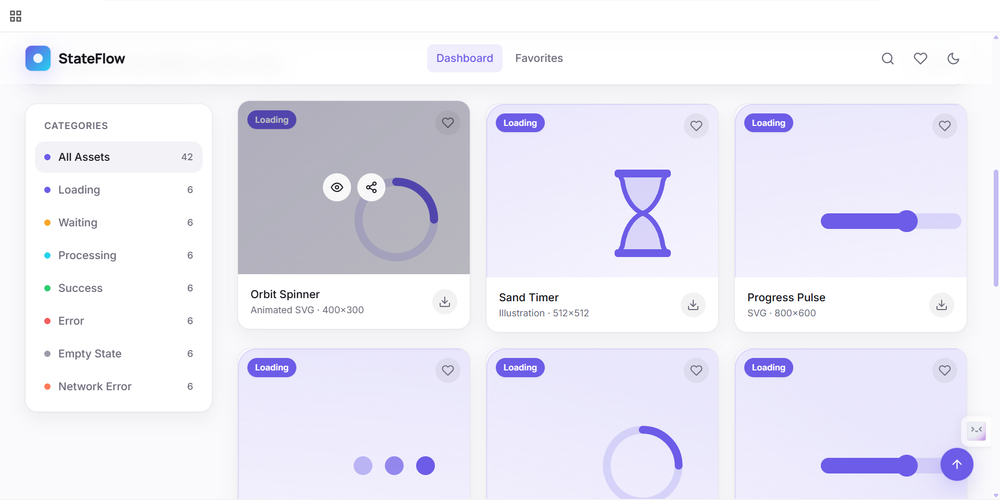
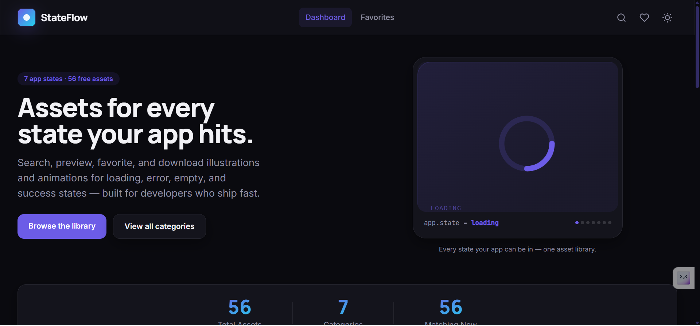
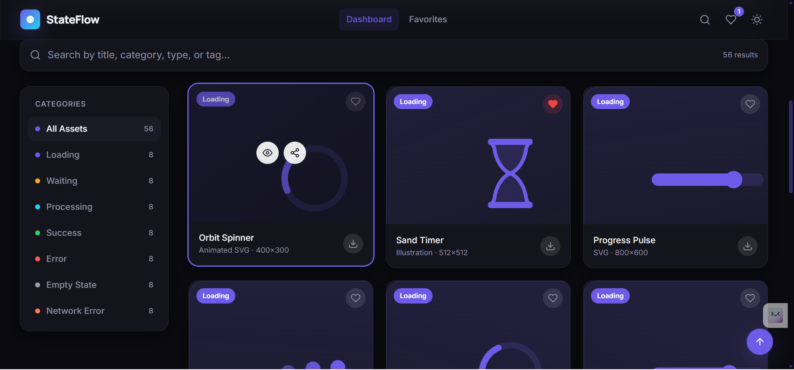
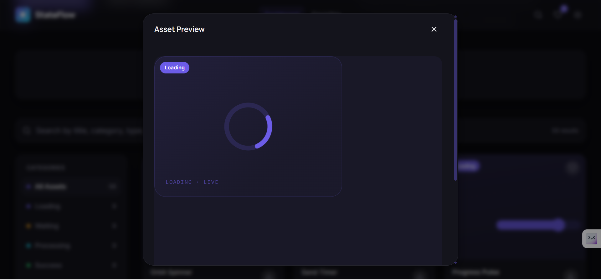
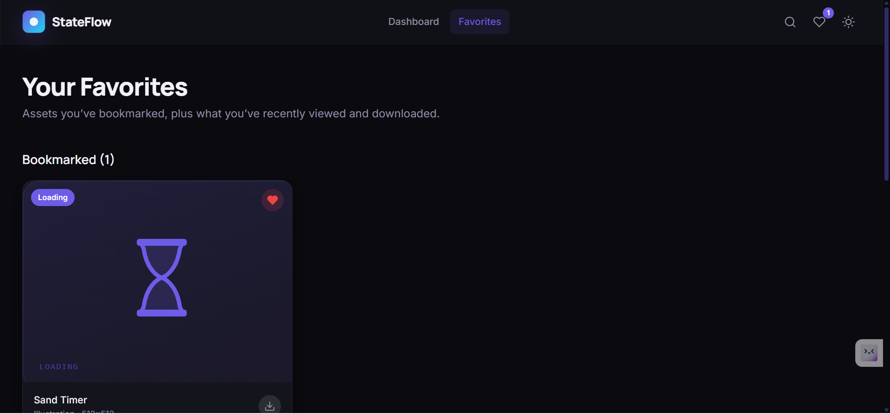
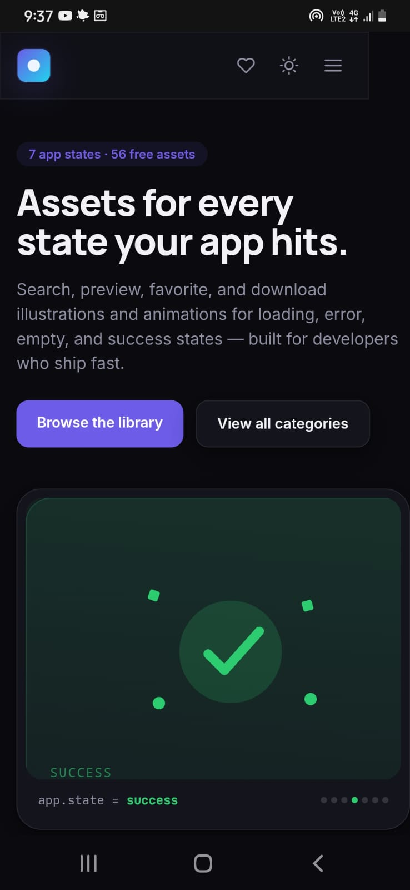

# StateFlow — Loading & Error Assets Dashboard


## ✨ Highlights

- 🔍 Smart Search with Debouncing
- 🎨 Light & Dark Theme
- ❤️ Favorites with LocalStorage
- 📂 Category Filtering
- 🖼️ Preview Modal
- ⬇️ SVG Download
- 📱 Fully Responsive

A production-style developer tool for finding, previewing, and downloading illustrations, motion assets, and dev-humor graphics for every state an application can be in — loading, waiting, processing, success, error, empty, and offline.

Built as a Frontend Developer Internship submission.

**[Live Demo →](https://stateflow-assets.netlify.app/)**
---

## 📸 Screenshots

### 🖥️ Dashboard (Light Mode)



---

### 🌙 Dashboard (Dark Mode)



---

### 🔍 Search & Filtering



---

### 👀 Asset Preview Modal



---

### ❤️ Favorites



---

### 📱 Mobile Responsive View



---

## Overview

Developers constantly need small, consistent visual assets for UI states, but end up hunting across icon packs, Dribbble shots, and Lottie libraries just to fill an empty list or a loading spinner. **StateFlow** solves this with a single searchable library, organized around the states real applications actually go through, with instant preview and one-click download — no sign-up, no external image hosts, works fully offline.

Every asset is generated as a self-contained SVG at build time, so previews and downloads work even without a network connection.

---

## Features

### Core
- **7 mandatory categories** — Loading, Waiting, Processing, Success, Error, Empty State, Network Error
- **56 assets in a genuinely mixed catalog** — see "Asset Formats" below; not a single SVG style relabeled six ways
- **Instant search** — by title, category, type, or tag, debounced for performance
- **Category filtering** — sidebar (desktop) and horizontal tabs (mobile), synced with the URL
- **Preview modal** — large preview, metadata, download, favorite, and share — closes on `Esc`, backdrop click, or the close button; traps focus while open and returns focus to the triggering card on close
- **Real downloads** — SVG assets download as `.svg`, Lottie assets download as `.json` (an actual valid Bodymovin file), via a generated Blob, with a loading → success animation and toast confirmation

### Asset formats (why it's not "just SVGs")
An early draft of this catalog was SVG-only with a couple of types relabeled to look varied — that's fixed. The catalog now has real format diversity:
- **SVG** — static illustrations
- **Animated SVG** — the same illustrations with real embedded CSS `@keyframes`, scoped per-asset so many can be on screen at once without colliding
- **Meme** — a captioned dev-humor card per category (original captions — see note below on why these aren't scraped from real meme sites)
- **Lottie** — a genuine, spec-valid Bodymovin JSON animation per category, rendered with `lottie-web` and downloadable as real `.json`
- **Icon Set / Illustration** — simpler supporting graphics for variety within each category

> **On real GIFs / scraped memes:** this project intentionally does not fetch GIFs or meme images from external sites (Giphy, Imgur, meme databases, etc.). Two reasons: this build environment has no network access to image hosts, and real meme templates/images carry copyright and licensing risk that doesn't belong in a portfolio project. Generating original SVG/CSS/Lottie assets keeps everything offline-safe, license-clean, and instantly downloadable — which is also a more defensible answer in an interview than "I scraped these."

### Bonus features (all implemented)
- Light/dark theme, persisted to `localStorage`
- Favorites/bookmarks, persisted to `localStorage`
- Recently Viewed and Recently Downloaded tracking
- Infinite scroll with a manual "Load more" fallback
- Skeleton loading states on first paint
- Toast notifications for favorites, downloads, and copy actions
- Copy Asset Link / Share on every card and in the preview modal
- Back-to-top button
- Keyboard shortcuts: `/` focus search · `d` toggle theme · `g` then `h`/`f` go to Dashboard/Favorites
- Custom favicon and custom scrollbar
- Animated hero that live-cycles through all 7 app states
- Animated stat counters (Total Assets / Categories / Matching Now)
- Dedicated "No results" empty state and a themed 404 page

---

## Tech Stack

| Layer | Choice |
|---|---|
| Framework | React 18 + Vite |
| Styling | Tailwind CSS (custom design tokens: color, radius, shadow, motion) |
| Animation | Framer Motion (UI) + lottie-web (Lottie asset playback, lazy-loaded) |
| Icons | React Icons (Feather set) |
| Routing | React Router v6 |
| State | React Context API (`Theme`, `Favorites`, `Recent`) |
| Persistence | `localStorage` via a shared `useLocalStorage` hook |
| Notifications | `react-hot-toast` |
| Data | Local JS module (`src/data/assets.js`) — no backend required |

---

## Folder Structure

```
src/
├── assets/                 # (reserved for static binary assets, if added later)
├── components/
│   ├── AssetCard/
│   ├── AssetGrid/
│   ├── BackToTop/
│   ├── CategoryTabs/
│   ├── DownloadButton/
│   ├── EmptyState/
│   ├── ErrorBoundary/       # catches render errors so one bad card can't blank the app
│   ├── FavoriteButton/
│   ├── Footer/
│   ├── Hero/
│   ├── Layout/
│   ├── LottiePreview/       # renders real Lottie JSON via a lazy-loaded lottie-web
│   ├── Navbar/
│   ├── PreviewModal/
│   ├── SearchBar/
│   ├── Sidebar/
│   ├── SkeletonCard/
│   └── Stats/
├── context/
│   ├── FavoritesContext.jsx
│   ├── RecentContext.jsx
│   └── ThemeContext.jsx
├── constants/
│   └── categories.js       # single source of truth for the 7 categories
├── data/
│   └── assets.js            # asset catalog (56 entries across 5 formats)
├── hooks/
│   ├── useDebounce.js
│   └── useLocalStorage.js
├── pages/
│   ├── Dashboard.jsx
│   ├── FavoritesPage.jsx
│   └── NotFound.jsx
├── utils/
│   ├── download.js            # format-aware download (Blob for SVG, JSON for Lottie) + slugify
│   ├── generateAssetSvg.js    # procedural SVG illustration + meme generator
│   └── generateLottieJson.js  # procedural, spec-valid Lottie/Bodymovin JSON generator
├── App.jsx
├── main.jsx
└── index.css
```

Each component lives in its own folder so styles, tests, or sub-components can be co-located later without restructuring.

## Architecture at a Glance

```
main.jsx
 └─ ErrorBoundary            (catches render crashes)
     └─ ThemeProvider        (localStorage-backed dark/light)
         └─ FavoritesProvider (localStorage-backed bookmarks)
             └─ RecentProvider (localStorage-backed viewed/downloaded)
                 └─ App.jsx  (routes + keyboard shortcuts)
                     ├─ Layout (Navbar, Footer, BackToTop, Toaster)
                     ├─ Dashboard (Hero, Stats, Search, Sidebar/Tabs, AssetGrid)
                     ├─ FavoritesPage
                     └─ NotFound
```

Context sits above the router so theme/favorites/recent state survives navigation between Dashboard and Favorites without prop drilling.

---

## Installation

**Requirements:** Node.js 18+ and npm 9+

```bash
git clone https://github.com/Sauravkolekar007/stateflow-assets-dashboard.git
cd stateflow-assets
npm install
```

## How to Run

```bash
npm run dev       # start the dev server (http://localhost:5173)
npm run build     # production build to /dist
npm run preview   # preview the production build locally
npm run lint      # run ESLint
```

---

## Accessibility

- Semantic HTML (`<header>`, `<nav>`, `<main>`, `<footer>`, `role="dialog"` modal)
- ARIA labels on every icon-only button (favorite, download, share, theme toggle, close)
- Full keyboard navigation, visible focus rings (`:focus-visible`), and `Esc`-to-close on the modal
- The preview modal traps `Tab`/`Shift+Tab` within itself while open and returns focus to whichever card opened it on close, instead of dropping focus back to `<body>`
- Respects `prefers-reduced-motion` by disabling animation durations
- Color choices checked for contrast in both light and dark themes

---

## Performance

- Route-based and vendor code splitting via Rollup `manualChunks`; `lottie-web` is additionally dynamic-`import()`-ed so its ~100KB parser never loads for the ~88% of assets that don't need it
- `React.memo` on `AssetCard` to avoid re-rendering unaffected cards
- Context provider values (`Theme`, `Favorites`, `Recent`) are wrapped in `useMemo` so unrelated state changes don't re-render every consumer in the tree
- Debounced search input (250ms) to avoid filtering on every keystroke
- Most assets are lightweight inline SVG (no image requests, no layout shift); Lottie assets render via `lottie-web`'s SVG renderer for the same reason
- Skeleton states instead of blank screens during initial load and while a Lottie animation is mounting

---

## Future Improvements

- Swap procedurally-generated SVGs for a curated set of licensed Lottie/GIF assets with a real CDN
- "Upload your own asset" flow with client-side validation and local persistence
- Multi-select bulk download (zip export)
- Team/workspace collections for shared favorites
- Unit tests (Vitest + React Testing Library) for filtering, favorites, and downloads

---

## Deployment

This is a static Vite build, so it deploys to either platform in minutes.

**Vercel**
```bash
npm i -g vercel
vercel
```

**Netlify**
```bash
npm run build
# then drag-and-drop the /dist folder onto Netlify, or:
netlify deploy --prod --dir=dist
```

After deploying, replace the placeholder link at the top of this README with your live URL.

---

## 👨‍💻 Author

Built by **Saurav Balaso Kolekar**

- GitHub: https://github.com/Sauravkolekar007
- LinkedIn: https://www.linkedin.com/in/saurav-kolekar-623bb61b5
- Portfolio: https://sauravkolekar.lovable.app

## License

Released under the [MIT License](./LICENSE).
